# ALE Ticket Management Tool
## User Guide

**Purpose:** Help employees use the ALE Ticket Management Tool to report and follow lab and support issues.

**Audience:** Requesters, Support Engineers, and Managers.

**Scope:** This guide describes only the currently implemented Phase 1 application. Screens and actions can change as the tool evolves. ALE single sign-on and internal notes are not available in this release.

## 1. Introduction

The ALE Ticket Management Tool gives lab and support teams one place to record an issue, share its setup details, assign work, communicate publicly, and follow status changes. It replaces long email chains with a ticket that requesters and support staff can return to as work progresses.

Users can create and review tickets, provide public updates, and, depending on role, assign tickets or change their status.

## 2. Who Should Use This Guide

- **Requester:** Reports an issue, views their own tickets, adds public comments, and can reopen one of their closed tickets.
- **Support Engineer:** Reviews tickets across requesters, self-assigns an unassigned ticket, and works on tickets assigned to them.
- **Manager:** Reviews tickets across requesters, assigns or reassigns work, and uses the available status actions to oversee ticket progress.

## 3. Roles and Permissions

The matrix reflects actions currently available in the application. “Own ticket” means a ticket submitted by the requester. Support Engineers and Managers can view tickets from all requesters.

| Action | Requester | Support Engineer | Manager |
| --- | --- | --- | --- |
| Create a ticket | ✓ | ✓ | ✓ |
| View own tickets | ✓ | ✓ | ✓ |
| View tickets from all requesters | — | ✓ | ✓ |
| View ticket details and public activity | Own tickets | All tickets | All tickets |
| Self-assign an unassigned ticket | — | ✓ | ✓ |
| Assign or reassign another active support engineer or manager | — | — | ✓ |
| Change status | Reopen own Closed ticket only | Assigned tickets only | ✓, subject to the workflow controls |
| Add a public comment | Own tickets | All tickets | All tickets |
| Create or view internal notes | Not available | Not available | Not available |
| Resolve a ticket | — | Assigned tickets | ✓ |
| Close a Resolved ticket | — | Assigned tickets | ✓ |
| Reopen a Resolved ticket | — | Assigned tickets | ✓ |
| Reopen a Closed ticket | Own tickets | Assigned tickets | ✓ |

**Permission differences:** Requesters are limited to tickets they submitted. Support Engineers and Managers can view all tickets. A Support Engineer can claim an unassigned ticket for themselves, but cannot take over or reassign a ticket already assigned to someone else. Managers can choose an active Support Engineer or Manager as the assignee. Every comment entered through the current comment form is public to users who can view that ticket.

The status actions still follow the workflow described in Section 6. In particular, a Support Engineer must be the ticket assignee before changing its status. A Requester can only reopen their own Closed ticket; they cannot resolve or close tickets.

## 4. Accessing the Application

1. Open the application address provided by your ALE Ticket Management Tool administrator or project owner.
2. Enter the email address and password for your account, then select **Sign in**.
3. After signing in, the application opens the Dashboard. The header shows your name and role.
4. To leave the application, select **Logout**. You return to the sign-in page.

The current sign-in screen uses an email and password in the Phase 1 development environment. It is not ALE single sign-on. Accounts that require a first-time password change show a password-change page before the rest of the application can be used; after changing the password, sign in again.

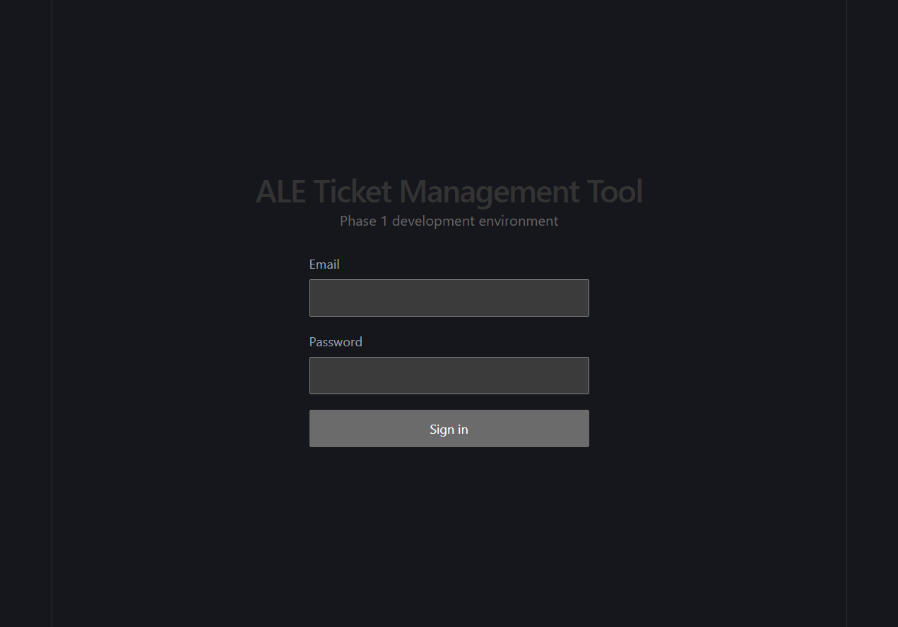

*The sign-in page shown in the running local Phase 1 application. No credentials are displayed.*

## 5. Application Navigation

The header provides the following links:

| Navigation item | What it opens | When to use it |
| --- | --- | --- |
| **Dashboard** | Ticket summary, tickets needing attention, and recently updated tickets | Start here for a quick view of work visible to your role |
| **Tickets** | Ticket List | Browse tickets and open a ticket by selecting its number |
| **Create Ticket** | Ticket creation form | Report a new issue |
| **Logout** | Ends the current signed-in session and returns to sign-in | Use when you finish or leave a shared workstation |

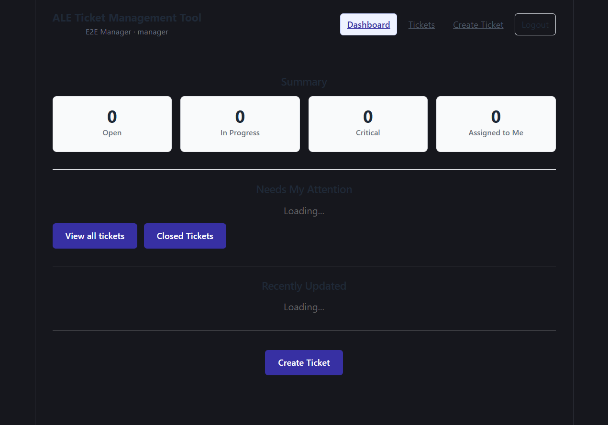

*The Dashboard includes summary links, a short attention list, recently updated tickets, and a Create Ticket link. Counts and tickets reflect the signed-in role; the screenshot uses local test data.*

The Dashboard summary links open list views for **Open**, **In Progress**, **Critical**, and **Assigned to Me** tickets. **Closed Tickets** opens the closed-ticket list. **Needs My Attention** and **Recently Updated** show a short selection; **View all tickets** opens the full list.

## 6. Ticket Lifecycle Overview

The statuses currently recognized by the application are **New**, **Open**, **In Progress**, **Resolved**, and **Closed**. The diagram includes the transition accepted by the service from New to Open; the current page does not provide a control for that transition. The New-ticket button labeled **OPEN** instead moves a ticket directly to **In Progress**.

```mermaid
stateDiagram-v2
    [*] --> New
    New --> Open: accepted transition; no current UI action
    New --> InProgress: OPEN button (moves directly to In Progress)
    Open --> InProgress: Start Progress
    InProgress --> Resolved: Resolve with a resolution
    Resolved --> InProgress: Reopen
    Resolved --> Closed: Close
    Closed --> InProgress: Reopen
```

| Status | What it means to the Requester | What it means to the Support Engineer | Typical change |
| --- | --- | --- | --- |
| **New** | The issue has been submitted. | The ticket is waiting to be taken up; an engineer can self-assign it if it is unassigned. | Set automatically when a ticket is created. |
| **Open** | The ticket is recorded as open. | The ticket can be moved to In Progress. | The service accepts New to Open, but the current user interface does not offer this action. |
| **In Progress** | Support work is underway. | The assigned engineer is investigating or addressing the issue. | An eligible user starts work or reopens a Resolved or Closed ticket. |
| **Resolved** | Support has recorded a resolution for the issue. | A resolution is required, and it is also added to public activity as a comment. | An assigned engineer or Manager selects **Resolve** and enters a resolution. |
| **Closed** | The resolved ticket has been closed. | The ticket is closed after resolution; a **Closed** date is shown. | An assigned engineer or Manager selects **Close** on a Resolved ticket. |

New tickets are created as **New**. The current UI’s button reads **OPEN** but its target status is **In Progress**. The separate **Open** status is accepted by the service but has no corresponding transition button in the current UI; this distinction is called out so the button label is not mistaken for the resulting status.

## 7. Creating a Ticket

1. Select **Create Ticket** in the header or Dashboard.
2. In **Ticket Information**, enter a concise **Title** and a useful **Description**.
3. Select a **Priority**: **Low**, **Medium**, **High**, or **Critical**.
4. Complete the five required fields in **Setup Information**: **Server Name**, **Server IP**, **Platform**, **DUT**, and **AOS Image Build**.
5. Add any useful optional setup values. Do not enter passwords, credentials, tokens, or other secrets.
6. Review the title, description, priority, and setup values, then select **Create Ticket**.
7. Look for **Ticket created successfully** and the ticket number. The application then opens the new ticket automatically.

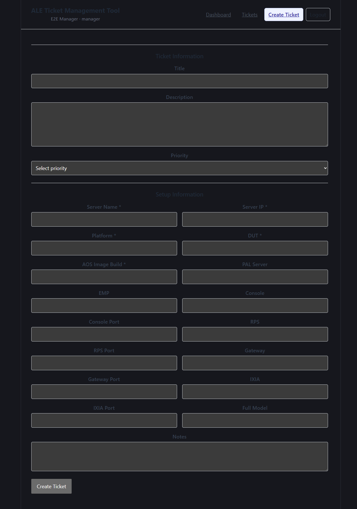

*The form shows Ticket Information followed by the required and optional Setup Information fields.*

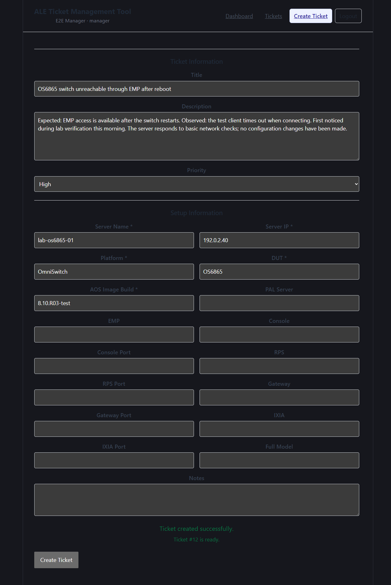

*A successful submission displays the new ticket number before opening its detail page.*

### Ticket Information Fields

| Field | Required? | What to enter |
| --- | --- | --- |
| **Title** | Yes | A short, specific summary. Up to 200 characters. Example: “OS6865 switch unreachable through EMP after reboot.” |
| **Description** | Yes | What you expected, what happened, when it began, and relevant checks or errors. |
| **Priority** | Yes | Select one of the four available labels based on the issue’s urgency. The application does not provide separate priority definitions. |

The requester is taken from the signed-in account; there is no requester field to fill in. A new ticket starts with status **New** and no assignee.

## 8. Providing Good Ticket Information

A useful title identifies the affected equipment or service and the symptom.

- **Good:** “OS6865 switch unreachable through EMP after reboot”
- **Less useful:** “Switch issue”

In the description, include the expected behavior, the observed behavior, when the issue occurred, relevant commands or error text, and troubleshooting already attempted. Keep the description factual and reproducible. Only include information the form supports; the form has no attachment control.

## 9. Setup Information

Setup values are saved with the ticket so that the configuration context supplied when the issue was reported remains available on the ticket detail page. They are a snapshot, not a live inventory lookup. All five fields marked with an asterisk are required by both the form and the service.

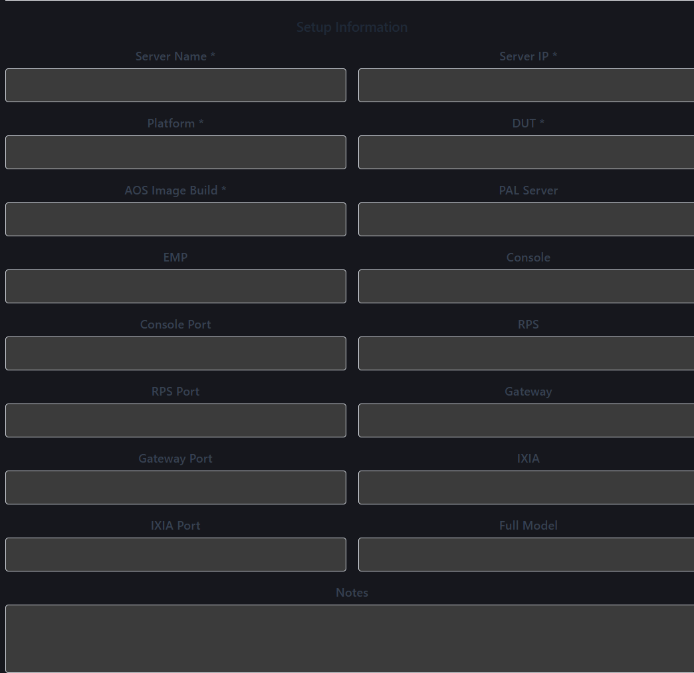

*The required fields are marked with an asterisk. Other values may be left blank when they do not apply.*

| UI label | Required? | What it represents |
| --- | --- | --- |
| **Server Name** | Required | Host or server name associated with the lab issue. |
| **Server IP** | Required | Relevant server or host IP address. |
| **Platform** | Required | Product or platform under test. |
| **DUT** | Required | Device under test. |
| **AOS Image Build** | Required | Software image or build associated with the setup. |
| **PAL Server** | Optional | Relevant PAL server, if used. |
| **EMP** | Optional | Relevant EMP endpoint or system information. |
| **Console** | Optional | Console connection information that is safe to share. |
| **Console Port** | Optional | Console port identifier. |
| **RPS** | Optional | Relevant RPS information. |
| **RPS Port** | Optional | RPS port identifier. |
| **Gateway** | Optional | Relevant gateway information. |
| **Gateway Port** | Optional | Gateway port identifier. |
| **IXIA** | Optional | Relevant IXIA information. |
| **IXIA Port** | Optional | IXIA port identifier. |
| **Full Model** | Optional | Full product model, if known. |
| **Notes** | Optional | Other non-sensitive setup context; up to 4,000 characters. |

Text fields allow up to 255 characters, port fields up to 20 characters, and Notes up to 4,000 characters.

> **Warning:** Never enter passwords, credentials, API keys, tokens, or other secrets in any ticket field or comment. The current application does not provide a secret-detection safeguard; users must omit secrets themselves.

When the ticket is opened, the detail page shows the values that were saved. The current detail view displays the setup keys in a technical form such as `server_name`; the values are still the ones entered through the labeled form.

## 10. Viewing Tickets

The **Tickets** page shows a table with these columns:

| Column | Meaning |
| --- | --- |
| **Ticket** | The ticket number. Select it to open the ticket. |
| **Title** | The issue summary. |
| **Status** | The ticket’s current workflow status. |
| **Priority** | The selected priority. |
| **Assigned To** | The assignee’s name, or a dash when unassigned. |
| **Created** | When the ticket was submitted. |

The list is ordered newest first and displays ten tickets per page, with **Previous** and **Next** controls when more pages exist. Closed tickets are excluded from the default list. Use the Dashboard’s **Closed Tickets** link to open the closed list; that view provides an **Active Tickets** link back.

There is no free-text search box or filter panel on the Ticket List page. The Dashboard provides links to the current Open, In Progress, Critical, and Assigned to Me views. Requesters see only their own tickets; Support Engineers and Managers see tickets from all requesters.

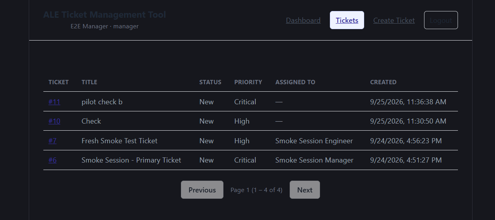

*The list displays ticket number, title, status, priority, assignee, and creation time. This capture is filtered to New tickets and uses local test data.*

## 11. Opening and Understanding a Ticket

Select a ticket number in the list or a ticket row on the Dashboard to open **Ticket Detail**. The page can show:

- Ticket number, title, status, and priority
- Description
- Requester and requester email
- Current assignee or **Unassigned**
- Created and Updated dates; Due and Closed dates appear only when values are present
- Resolution, after one has been recorded
- Setup Information saved with the ticket
- Activity and the public comment form

What controls appear depends on the signed-in role, the current status, and assignment. Requesters can open only their own tickets. Support Engineers and Managers can open tickets across requesters.

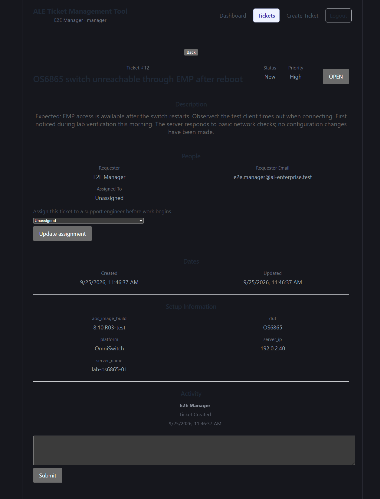

*A newly created ticket detail page shows its initial status, requester, assignment, setup snapshot, creation activity, and public comment form.*

## 12. Ticket Assignment

Requesters cannot assign tickets. A Support Engineer can select **Assign to me** only when a ticket is unassigned; the engineer cannot use that action to take over a ticket assigned to someone else. A Manager can use the **Assignee** list and **Update assignment** to assign or reassign an active Support Engineer or Manager, or set the ticket to **Unassigned**.

To assign a ticket to a Support Engineer:

1. Open the ticket detail page.
2. In **People**, choose an active Support Engineer from **Assignee**.
3. Select **Update assignment** and check the **Assigned To** value.

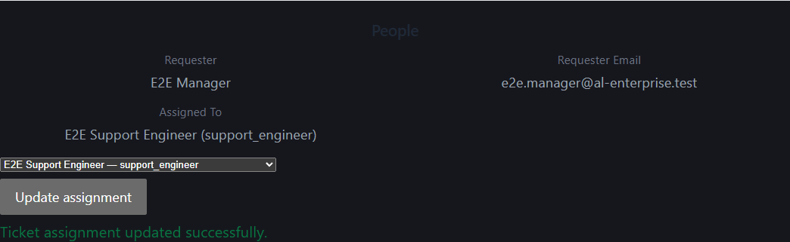

*The Manager view shows the current assignee, an assignee selector, and the Update assignment action. The example assignment uses a local test account.*

For a Support Engineer to claim an unassigned ticket, open its detail page and select **Assign to me**. Once the ticket has another assignee, the engineer cannot take it over using this control.

> **Screenshot TODO:** Capture the Support Engineer view showing **Assign to me** on an unassigned ticket. The shared browser session available for this guide was authenticated as a Manager; no safe Support Engineer sign-in was available for a capture.

## 13. Updating Ticket Status

Status actions appear on Ticket Detail when allowed by the current role and ticket state. A Support Engineer must be the assignee to change a status. A Manager can use the status actions described below; the special New-ticket start also requires the current user to be the assignee.

| Current status | Available action | Result and requirement |
| --- | --- | --- |
| **New** | **OPEN** | Moves directly to **In Progress**, not Open. The current user must be assigned to the ticket. |
| **Open** | **Start Progress** | Moves to **In Progress**. |
| **In Progress** | **Resolve** | Requires text in **Resolution** and moves to **Resolved**. |
| **Resolved** | **Reopen** | Moves back to **In Progress**. |
| **Resolved** | **Close** | Moves to **Closed**. |
| **Closed** | **Reopen** | Moves back to **In Progress**. A Requester may do this only on their own ticket. |

To resolve a ticket, enter a clear resolution in the **Resolution** field and select **Resolve**. The resolution is also added to Activity as a public comment. To close the ticket, select **Close** after it is Resolved. Reopening a closed ticket returns it to In Progress; the previous resolution remains on the ticket.

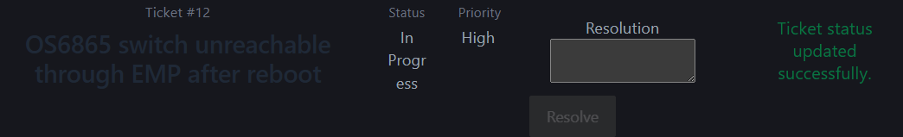

*After the New-ticket **OPEN** action, the status is In Progress and the Resolution field is available. Resolution text is required before Resolve can be selected.*

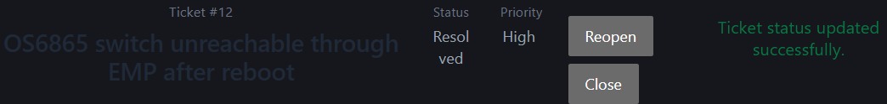

*A Resolved ticket offers Reopen and Close. Closing is available only after a resolution has been recorded.*

## 14. Comments and Communication

Ticket Detail provides a **New comment** box and **Submit** button. A Requester can comment on their own ticket. Support Engineers and Managers can comment on tickets they can view. Comments appear in Activity with the author and time.

Use the comment form for information that should be visible to the requester and support staff, for example: “EMP access is restored. Please verify connectivity from your side.” The current form has no public/internal selector; every comment submitted through it is public. Blank comments are rejected.

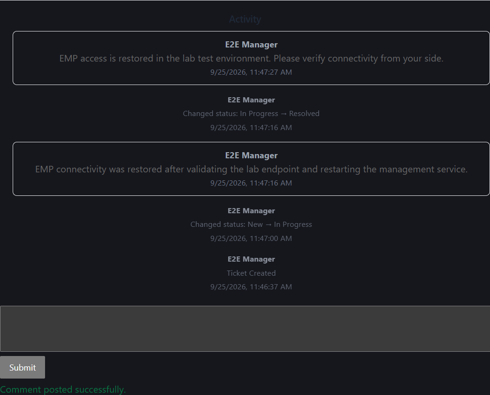

*The submitted comment appears in Activity alongside status history. The same ticket’s Resolution is also displayed as a public comment.*

## 15. Internal Notes

Internal notes are not available in the current application. There is no internal-note control, and the ticket comment form creates public comments only. Do not put internal-only information in the comment form; anyone permitted to view the ticket can see those comments.

## 16. Activity and Ticket History

**Activity** combines status history and comments into one newest-first timeline. The current application records and displays:

- **Ticket Created** when the ticket is submitted
- Status changes, including the previous and new status
- Public comments, including the author, text, and time
- The resolution text as a public comment when the ticket is resolved

History entries such as **Changed status: In Progress → Resolved** are system-formatted records of a workflow action. Comment entries show the text a user submitted. Assignment changes update the ticket’s Updated date, but do not currently appear as Activity entries.

The current application does not provide a separate activity event for every possible action. Do not expect assignment changes to appear in the timeline.

## 17. Closing a Ticket

Only a **Resolved** ticket can be closed. A Support Engineer assigned to the ticket or a Manager can select **Close**. Requesters cannot close tickets. The ticket status becomes **Closed**, a Closed date appears in **Dates**, and the status change appears in Activity.

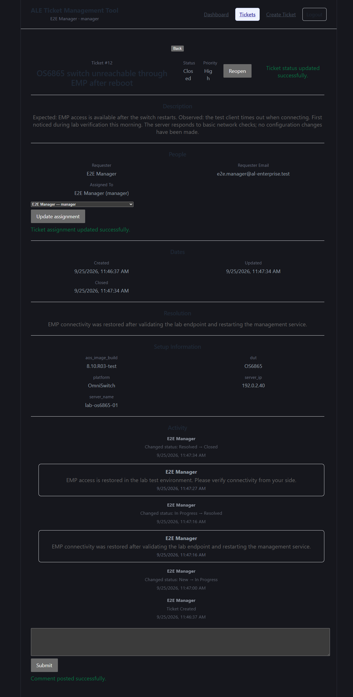

*A closed ticket shows its Closed date and status-history entry. The Manager view offers Reopen; a Requester can reopen only their own closed ticket.*

## 18. Reopening a Ticket

An assigned Support Engineer or Manager can reopen a Resolved or Closed ticket. A Requester can reopen only their own **Closed** ticket, not a Resolved ticket. Reopening changes the status to **In Progress** and appears in Activity. When a Closed ticket is reopened, the Closed date is cleared; the earlier resolution text remains available on the ticket.

> **Screenshot TODO:** Capture an owned Closed ticket from a Requester session showing the Reopen action. The shared browser session available for this guide was authenticated as a Manager; no safe Requester sign-in was available for a capture.

## 19. End-to-End Requester Example

1. Sign in and select **Create Ticket**.
2. Enter a specific issue title and describe expected versus observed behavior.
3. Choose a priority and complete the five required Setup Information fields with non-sensitive values.
4. Submit the ticket and note its number when the success message appears.
5. Open the ticket from the Dashboard or Tickets page. A Requester sees only tickets submitted by their own account.
6. Read support updates in Activity and use **New comment** to provide a public response or requested clarification.
7. When support resolves the issue, review the Resolution and public activity. A Requester cannot close the ticket. If a Closed ticket needs more work, reopen that owned ticket to return it to In Progress.

The requester workflow does not include private comments, file attachments, or requester-controlled assignment.

## 20. End-to-End Support Engineer Example

1. Sign in and review the Dashboard or **Tickets** list; Support Engineers can view tickets from all requesters.
2. Open an unassigned ticket and select **Assign to me**. An engineer cannot take over a ticket that is already assigned to another person.
3. On a New ticket assigned to you, select **OPEN**. The resulting status is **In Progress**.
4. Investigate the reported issue and use the public comment form to communicate updates with the requester.
5. When the issue is resolved, enter a concise Resolution and select **Resolve**. The resolution appears in Activity as a public comment.
6. If the issue is confirmed complete, select **Close**. If further work is needed, use **Reopen** where it is offered.

> **Screenshot TODO:** Capture the Support Engineer workflow, including self-assignment and its status actions. Only a Manager session was available in the shared browser for this guide.

## 21. End-to-End Manager Example

1. Sign in and review the Dashboard counts, attention list, and recently updated tickets.
2. Open a ticket and review its description, setup snapshot, current status, and Activity.
3. In **People**, choose an active Support Engineer in **Assignee**, then select **Update assignment**.
4. The assigned Support Engineer can start the New ticket and update its status while it remains assigned to them. The Manager can review progress, add public comments, and use the available status actions.
5. After the ticket is Resolved, close it if the work is complete, or reopen it when more work is required.

Managers can also assign a ticket to an active Manager. Use a Support Engineer assignee when handing off technical work.

## 23. Common Errors and What They Mean

| Message or behavior | Likely reason | What to do |
| --- | --- | --- |
| **Title is required.**, **Description is required.**, **Priority is required.**, or a setup field is required | A required form field is blank. | Complete the named field and submit again. |
| **Invalid email or password.** | The sign-in details did not match an account. | Check the email and password, then try again. If access still fails, contact the tool administrator or project owner. |
| **You do not have permission to perform this action.** | The action is not allowed for your role, ticket ownership, assignment, or current status. | Confirm that you opened the correct ticket and that the required assignment or workflow step is complete. |
| **Ticket not found or you do not have access to it.** | The ticket does not exist or is outside the Requester’s visibility. | Check the ticket number or return to your own ticket list. |
| **Resolution is required to resolve a ticket.** | Resolve was selected without resolution text. | Enter a concise resolution, then select **Resolve**. |
| **Comment cannot be blank.** | The comment form was submitted without text. | Enter a public comment before selecting **Submit**. |
| **The request contains invalid data.** | A status change or assignment value was not accepted for the current ticket state or available users. | Use an action currently shown on Ticket Detail, or choose an active person listed in **Assignee**. |
| **The ticket was updated by another request.** | Another user changed the ticket before your update completed. | Return to or reload Ticket Detail to see the current status, then retry if the action is still available. |

If a page displays a generic request failure, retry once. If it continues, note the ticket number and contact the tool administrator or project owner.

## 24. Best Practices

- Use a specific title that names the product or component and symptom.
- Include reproducible details, observed errors, when the issue occurred, and checks already performed.
- Enter accurate setup values and leave optional fields blank when they do not apply.
- Use public comments for requester/support communication; there is no internal note workflow.
- Keep status current as work progresses and enter a useful resolution before resolving.
- Never put passwords, credentials, tokens, keys, or other secrets in a ticket.
- Continue the discussion on the existing ticket rather than creating a duplicate for the same issue.

## 25. Frequently Asked Questions

**Who can see my ticket?**

Requesters can see tickets submitted by their own account. Support Engineers and Managers can see tickets across requesters.

**Can I edit a ticket after creating it?**

The current user interface does not provide controls to edit the title, description, priority, or setup values after creation. You can add public comments.

**Who can assign a ticket?**

Requesters cannot assign tickets. Support Engineers can assign an unassigned ticket to themselves. Managers can assign or reassign an active Support Engineer or Manager.

**What is the difference between a public comment and an internal note?**

The current application supports public comments only. It has no internal-note option; every comment entered through the form is visible to users who can view the ticket.

**Can requesters see internal notes?**

There is no internal-note workflow in the current application. Do not use the public comment form for internal-only information.

**What does Resolved mean?**

Support has recorded a resolution. The Resolution field is required, and its text also appears as a public comment in Activity.

**What does Closed mean?**

The Resolved ticket has been closed. A Closed date is shown. A Requester cannot close a ticket.

**Can a closed ticket be reopened?**

Yes. A Requester can reopen their own Closed ticket; an assigned Support Engineer or Manager can also reopen a Closed ticket. It returns to In Progress.

**What should I put in Setup Information?**

Provide the five required values and any applicable optional lab connection or equipment context. Never include credentials or secrets.

**Should I enter switch passwords in the ticket?**

No. The application does not scan for secrets, so do not enter passwords, keys, tokens, or other credentials.

**Where can I see changes made to the ticket?**

Open Ticket Detail and review Activity. It shows ticket creation, status changes, and public comments. Assignment changes are not listed there.

**Is there a ticket search or filter form?**

There is no free-text search box or filter panel. Use the Dashboard links for the views currently provided.

**Are alerts or email notifications sent when a ticket changes?**

The current application does not provide notification alerts. Check the Dashboard or ticket Activity for updates.

## 26. Current Limitations

- Internal notes, attachments, and post-creation editing are not available.
- The Ticket List has no free-text search or filter panel; only the Dashboard’s current view links are provided.
- Assignment changes update the ticket but are not shown as Activity entries.
- The **Open** status is accepted by the service, but there is no current UI action to move a ticket to Open. On a New ticket, **OPEN** moves it directly to In Progress.
- Notification alerts are not provided by the current application.
- Sign-in currently uses local email and password; ALE single sign-on is not available.

## 27. Getting Help

Contact the ALE Ticket Management Tool administrator or project owner.

## 28. Glossary

| Term | Meaning in this application |
| --- | --- |
| **Requester** | The signed-in user who submits a ticket; requesters can view only tickets they created. |
| **Support Engineer** | A role that can view all tickets and update tickets assigned to that engineer. |
| **Manager** | A role that can view all tickets, assign work, and use available ticket status actions. |
| **Ticket** | The record for an issue, including its title, description, priority, setup snapshot, status, comments, and history. |
| **Assignee** | The active Support Engineer or Manager currently assigned to a ticket; a ticket may be unassigned. |
| **Priority** | One of the ticket labels Low, Medium, High, or Critical. |
| **Status** | The ticket’s current workflow state: New, Open, In Progress, Resolved, or Closed. |
| **Public Comment** | A comment visible to users who can view the ticket. The current comment form creates public comments only. |
| **Internal Note** | Not available in the current application. |
| **Activity** | The newest-first ticket timeline of creation, status changes, and public comments. |
| **Setup Information** | Lab and equipment details saved with the ticket at the time it is created. |